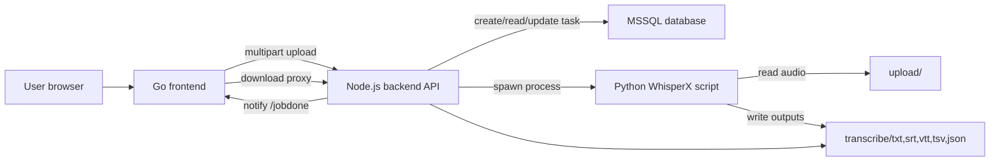

# TranscriptHub Project Overview

TranscriptHub is an AI audio transcription system. It combines a Go web frontend, a Node.js backend API, a Microsoft SQL Server task database, and Python WhisperX scripts for transcription.

The repository is organized around two runnable applications:

- `apps/frontend`: Go server-rendered web UI for users.
- `apps/backend`: Node.js API and transcription task runner.

Supporting assets live in:

- `apps/backend/scripts`: WhisperX Python scripts, database migration script, Windows runner.
- `apps/backend/sql`: raw SQL schema files.
- `apps/frontend/www`: static assets and Go HTML templates.
- `doc` and `image`: project presentation material and screenshots.

## Runtime Architecture

## Main Components

### Frontend

The frontend is a Go application in `apps/frontend`.

Responsibilities:

- Serve the home page and transcription UI.
- Accept user uploads at `/upload`.
- Store local job records in memory and in `tmp/joblists`.
- Forward uploaded files to the backend `CreateTranscribeTask` API.
- Receive backend completion callbacks at `/jobdone`.
- Proxy result downloads through `/result/{taskID}/{fileType}`.

Important files:

- `server.go`: loads `envfile`, starts the Go HTTP server.
- `router.go`: route registration.
- `upload.go`: receives browser uploads and creates local job records.
- `afterupload.go`: forwards files to backend.
- `jobs.go`: local job state model and persistence.
- `jobdone.go`: receives backend status notifications and deletes jobs.
- `download.go`: proxies result downloads from backend.
- `userinf.go`: placeholder user identity implementation.
- `www/template/*.tpl`: server-rendered pages.

### Backend

The backend is a Node.js application in `apps/backend`.

Responsibilities:

- Expose the REST API under `/api/v1/rest`.
- Store uploaded audio files under `upload/`.
- Create and update task records in MSSQL.
- Poll for pending tasks and execute WhisperX.
- Write transcript outputs under `transcribe/`.
- Notify the frontend when a task finishes.
- Authorize result downloads by task ownership.

Important files:

- `main.js`: Express app, cluster worker setup, task scheduler, API route registration.
- `config.js`: environment and runtime path configuration.
- `controller/task_controller.js`: API endpoint behavior.
- `services/task_service.js`: DB task operations and result path resolution.
- `db.js`: MSSQL connection pool.
- `query_constants.js`: SQL query definitions.
- `scripts/db-migrate.js`: idempotent database migration helper.

### Python WhisperX Pipeline

The transcription script currently used by the backend is:

- `apps/backend/scripts/exec_whisperx_task_v1.2.py`

Pipeline:

1. Read `WHISPERX_CONFIG_PATH` or `scripts/config.json`.
2. Convert uploaded audio to mono using ffmpeg.
3. Load WhisperX model.
4. Transcribe audio.
5. Align timestamps.
6. Optionally run speaker diarization.
7. Convert Chinese text to Traditional Chinese.
8. Use CKIP segmentation for Chinese subtitle handling.
9. Write TXT, SRT, VTT, TSV, and JSON outputs.

## Task Lifecycle

There are three related status systems:

- Backend DB task status: task execution lifecycle in `TASK.STATUS`.
- Backend notification status: values sent back to the frontend.
- Frontend job status: strings shown in the web UI.

Current backend DB statuses:

| Value | Name | Meaning |
| --- | --- | --- |
| `0` | CREATED | Task created and waiting. |
| `1` | IN_PROGRESS | Worker is executing the task. |
| `2` | COMPLETED | Task completed and outputs were written. |
| `-1` | CANCELLED_BY_USER | User cancellation. |
| `-2` | TERMINATED | Worker or system terminated the task. |
| `-3` | FILE_IO_ERROR | Output file could not be read or written. |

Current notification statuses:

| Value | Meaning |
| --- | --- |
| `10` | Finished. |
| `5` | Pending/queued. |
| `1` | Cancelled. |
| `0` | Error. |

Frontend job statuses currently include `sending`, `pending`, `Done`, `Queue`, `Canceled`, and `Error`.

These should be normalized in a future cleanup. Until then, changes involving task status must check all three layers.

## Key Integration Points

### Upload

Browser uploads to:

- Frontend: `POST /upload`

Frontend forwards to:

- Backend: `POST /api/v1/rest/CreateTranscribeTask`

Backend expects multipart field:

- `audiofile`: uploaded media file.

Frontend sends:

- `label`
- `sso_account`
- `token`
- `multiplespeaker`

### Completion Notification

Backend sends JSON to the frontend:

- `POST /jobdone`

Payload includes:

- `task_objid`
- `status`
- `message`
- `results`

The `results` array contains backend download URLs.

### Download

Browser clicks frontend result links:

- `/result/{taskID}/{fileType}`

Frontend maps the task ID to the backend result filename and proxies from:

- `/api/v1/rest/RetrieveTranscribe/{FORMAT}/{filename}`

## Current Operational Assumptions

- Backend uses MSSQL.
- Backend HTTPS requires `key.pem` and `certificate.pem` under `TASK_HOME`.
- Backend Python execution requires `PYTHON_BIN`.
- WhisperX config requires real filesystem paths for upload, uploadlc, transcribe, and log directories.
- Frontend user authentication is currently a placeholder and should be replaced before production use.
- Backend accepts broad upload MIME types and relies on ffprobe/media handling later.

## Known Documentation Gaps To Close Later

- A full troubleshooting matrix.
- A formal API schema.
- A task status normalization spec.
- Production authentication and authorization design.
- Deployment guide for a real server.
- Smoke test and health check scripts.
